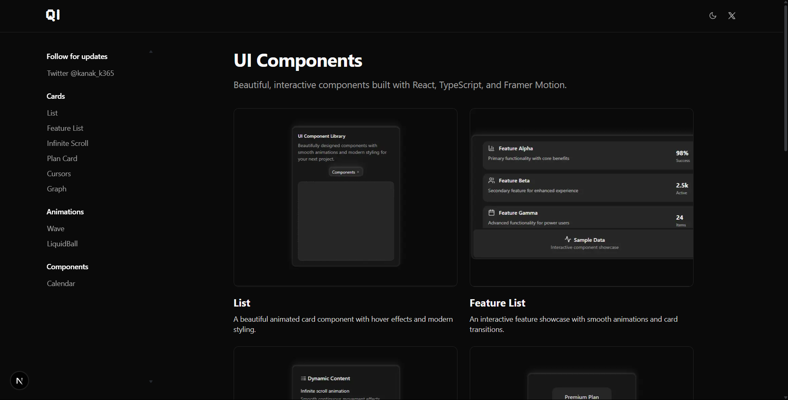
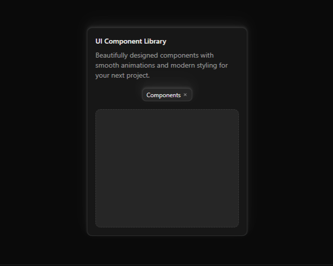
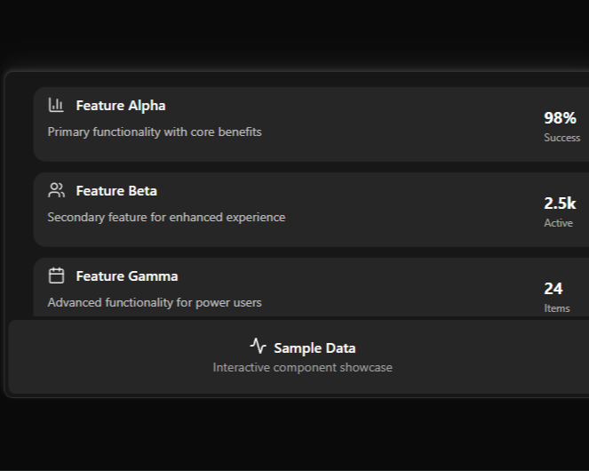
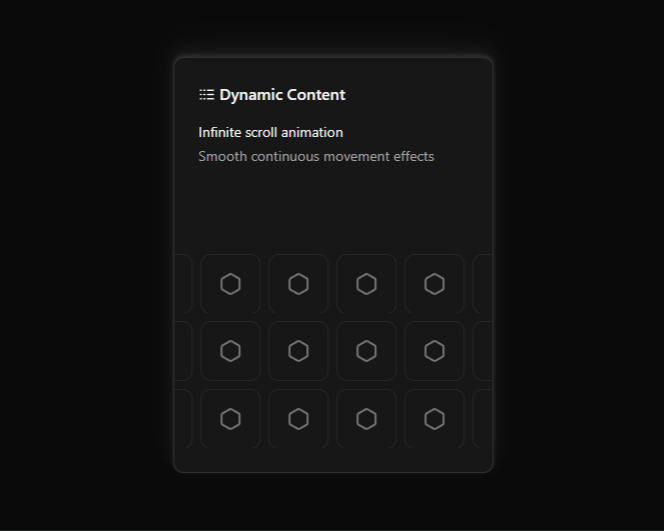
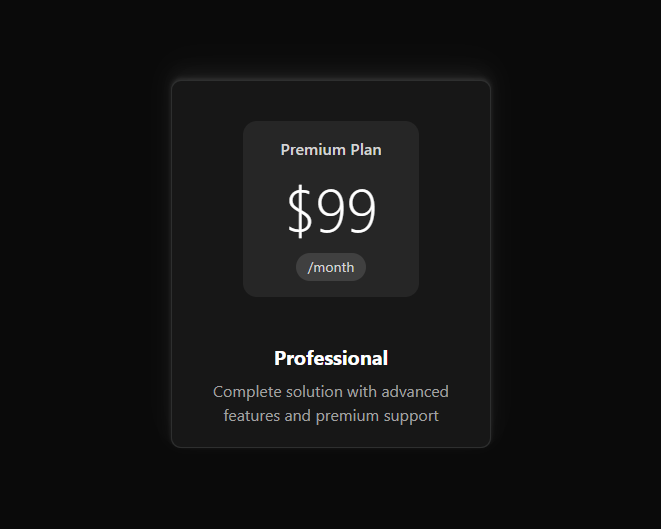
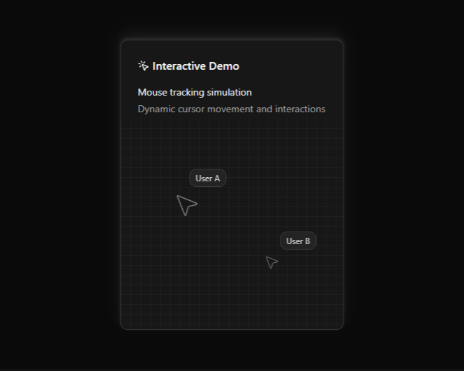
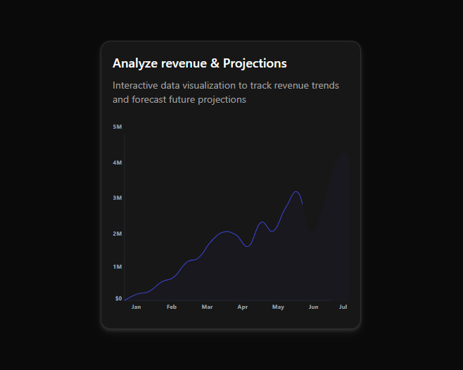
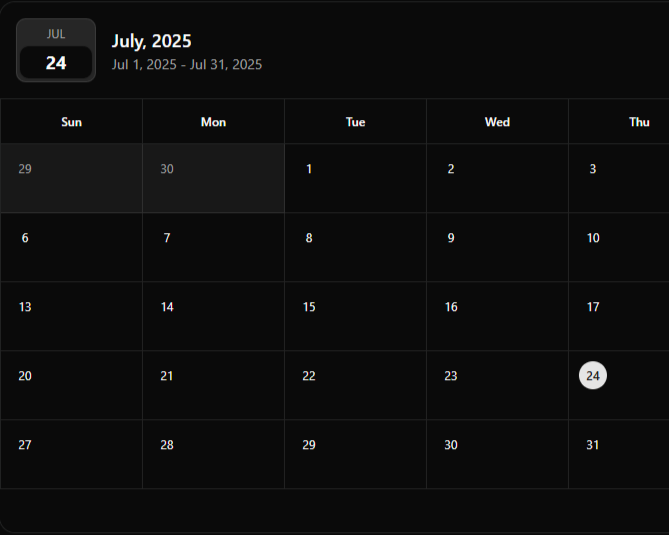
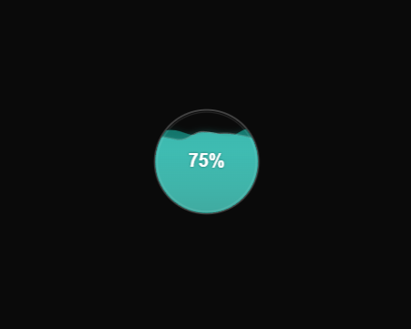

# QI - Interactive UI Component Library

A beautiful collection of interactive React components built with TypeScript, Framer Motion, and Tailwind CSS. Each component features smooth animations, modern design patterns, and is fully customizable.



## ✨ Features

- **10+ Interactive Components** - Beautiful, animated components ready for production
- **TypeScript Support** - Fully typed components for better development experience
- **Framer Motion Animations** - Smooth, performant animations throughout
- **Responsive Design** - All components work seamlessly across devices
- **Dark Mode Support** - Built-in theme switching capabilities
- **Modern Tech Stack** - Next.js 15, React 19, Tailwind CSS 4
- **Zero Dependencies** - Minimal external dependencies for easy integration

## 🎨 Components

| Component | Description | Preview |
|-----------|-------------|---------|
| **List** | Animated card component with hover effects and modern styling |  |
| **Feature List** | Interactive feature showcase with smooth animations |  |
| **Infinite Scroll** | Smooth infinite scrolling with animated content |  |
| **Plan Card** | Pricing plan card with hover animations |  |
| **Cursors** | Interactive cursor tracking with mouse following |  |
| **Graph** | Interactive data visualization with charts |  |
| **Calendar** | Full-screen calendar with event management |  |
| **Liquid Ball** | Animated liquid ball with water physics |  |

## 🚀 Quick Start

### Prerequisites

- Node.js 18+ 
- npm or yarn

### Installation

1. **Clone the repository**
   ```bash
   git clone https://github.com/kanakk365/qi-ui-components.git
   cd qi-ui-components
   ```

2. **Install dependencies**
   ```bash
   npm install
   ```

3. **Start the development server**
   ```bash
   npm run dev
   ```

4. **Open your browser**
   Navigate to [http://localhost:3000](http://localhost:3000)

## 📦 Using Components in Your Project

### Method 1: CLI Installation (Recommended)

QI components are built with a registry system compatible with shadcn/ui CLI for easy installation.

#### Prerequisites

1. **Initialize shadcn/ui in your project** (if not already done):
   ```bash
   npx shadcn@latest init
   ```

2. **Ensure you have the required peer dependencies**:
   ```bash
   npm install tailwindcss class-variance-authority clsx tailwind-merge
   ```

#### Installing Components

```bash
# Install a specific component
npx shadcn@latest add https://qi.kanakk.me/r/list.json

# Install multiple components
npx shadcn@latest add https://qi.kanakk.me/r/calendar.json
npx shadcn@latest add https://qi.kanakk.me/r/cursors.json
```

The CLI will automatically:
- Install required dependencies
- Create necessary files in the correct locations
- Set up utility functions if needed

#### Available CLI Commands:

| Component | CLI Command |
|-----------|-------------|
| **List** | `npx shadcn@latest add https://qi.kanakk.me/r/list.json` |
| **Feature List** | `npx shadcn@latest add https://qi.kanakk.me/r/feature-list.json` |
| **Infinite Scroll** | `npx shadcn@latest add https://qi.kanakk.me/r/infinite-scroll.json` |
| **Plan Card** | `npx shadcn@latest add https://qi.kanakk.me/r/plan.json` |
| **Cursors** | `npx shadcn@latest add https://qi.kanakk.me/r/cursors.json` |
| **Graph** | `npx shadcn@latest add https://qi.kanakk.me/r/graph.json` |
| **Calendar** | `npx shadcn@latest add https://qi.kanakk.me/r/calendar.json` |
| **Wave** | `npx shadcn@latest add https://qi.kanakk.me/r/wave.json` |
| **Glass Navbar** | `npx shadcn@latest add https://qi.kanakk.me/r/glass-navbar.json` |

### Method 2: Manual Installation

1. **Install dependencies for the component you want:**
   ```bash
   npm install motion @tabler/icons-react lucide-react
   ```

2. **Add the utility function (if not already present):**
   ```typescript
   // lib/utils.ts
   import { ClassValue, clsx } from "clsx";
   import { twMerge } from "tailwind-merge";

   export function cn(...inputs: ClassValue[]) {
     return twMerge(clsx(inputs));
   }
   ```

3. **Copy the component code from the registry or documentation**

### Basic Usage

```jsx
import { List } from '@/components/ui/List'

function App() {
  return (
    <div>
      <List 
        title="My Component Library"
        description="Beautiful components for modern applications"
      />
    </div>
  )
}
```

### Available Components

- `List` - Animated card list component
- `FeatureList` - Interactive feature showcase
- `InfiniteScroll` - Smooth infinite scrolling
- `Plan` - Pricing plan cards
- `Cursors` - Interactive cursor tracking
- `Graph` - Data visualization charts
- `Calendar` - Full-screen calendar
- `LiquidBall` - Animated liquid ball
- `GlassNavbar` - Glass morphism navigation
- `Wave` - Animated wave effects

## 🏗️ Registry System

QI implements a complete component registry system similar to shadcn/ui, making it easy to install and manage components in your projects.

### How It Works

1. **Registry API**: Each component is served through a REST API endpoint (`/api/registry/[component]`)
2. **Component Metadata**: Includes dependencies, file paths, and installation instructions
3. **shadcn/ui Compatible**: Uses the same CLI and registry format for seamless integration
4. **Automatic Installation**: CLI handles dependency installation and file placement

### Registry Endpoints

- **Main Registry**: `https://qi.kanakk.me/api/registry` - Lists all available components
- **Component APIs**: `https://qi.kanakk.me/api/registry/[component-name]` - Individual component data
- **Public Registry**: `https://qi.kanakk.me/r/[component-name].json` - shadcn/ui compatible format

### Component Structure

Each component in the registry includes:
- **Source Code**: Complete component implementation
- **Dependencies**: Required npm packages
- **Installation Steps**: Manual setup instructions
- **Demo Code**: Usage examples
- **TypeScript Types**: Full type definitions

## 🛠️ Tech Stack

- **Framework**: [Next.js 15](https://nextjs.org/) with App Router
- **Language**: [TypeScript](https://www.typescriptlang.org/)
- **Styling**: [Tailwind CSS 4](https://tailwindcss.com/)
- **Animations**: [Framer Motion](https://www.framer.com/motion/)
- **Icons**: [Lucide React](https://lucide.dev/) & [Tabler Icons](https://tabler-icons.io/)
- **UI Components**: [Radix UI](https://www.radix-ui.com/)
- **Theme**: [next-themes](https://github.com/pacocoursey/next-themes)
- **Component Registry**: Custom registry system compatible with shadcn/ui CLI

## 📁 Project Structure

```
src/
├── app/                    # Next.js app directory
│   ├── api/               # API routes
│   │   └── registry/     # Component registry API endpoints
│   │       ├── route.ts  # Main registry endpoint
│   │       └── [component]/ # Individual component APIs
│   ├── components/       # Component showcase pages
│   └── page.tsx         # Homepage
├── components/            # Main UI components
│   ├── ui/               # Reusable UI components (buttons, etc.)
│   ├── components-page.tsx # Main component showcase
│   └── Navbar.tsx       # Navigation component
├── registry/             # Component implementations
│   └── default/
│       ├── ui/          # All component implementations
│       └── hooks/       # Custom React hooks
├── lib/                  # Utilities and configurations
│   ├── components/      # Component metadata and configurations
│   ├── component-map.ts # Component routing map
│   ├── types.ts         # TypeScript type definitions
│   └── utils.ts         # Utility functions
├── public/              # Static assets
│   ├── images/          # Component preview images
│   └── r/              # Public registry JSON files
├── components.json      # shadcn/ui configuration
└── registry.json       # Registry metadata
```

## 🎯 Contributing

We welcome contributions! Here's how you can help:

### Development Setup

1. Fork the repository
2. Create a feature branch: `git checkout -b feature/amazing-component`
3. Make your changes
4. Test your changes: `npm run dev`
5. Commit your changes: `git commit -m 'Add amazing component'`
6. Push to the branch: `git push origin feature/amazing-component`
7. Open a Pull Request

### Adding New Components

1. **Create the component implementation**
   ```bash
   # Create component file
   touch src/registry/default/ui/YourComponent.tsx
   ```

2. **Add component metadata and configuration**
   ```bash
   # Create component metadata
   touch src/lib/components/your-component.ts
   ```

3. **Create API endpoint for the registry**
   ```bash
   # Create API route
   mkdir src/app/api/registry/your-component
   touch src/app/api/registry/your-component/route.ts
   ```

4. **Add preview image**
   ```bash
   # Add component preview
   cp your-component-preview.png public/images/
   ```

5. **Update configuration files**
   - Add to `src/lib/component-map.ts`
   - Update `registry.json`
   - Add to main registry API in `src/app/api/registry/route.ts`

6. **Create public registry file**
   ```bash
   # This will be auto-generated or manually created
   touch public/r/your-component.json
   ```

### Code Style

- Use TypeScript for all new code
- Follow the existing component patterns
- Include proper JSDoc comments
- Ensure responsive design
- Add smooth animations with Framer Motion

## 📄 License

This project is licensed under the MIT License - see the [LICENSE](LICENSE) file for details.

## 🙏 Acknowledgments

- [Framer Motion](https://www.framer.com/motion/) for amazing animations
- [Radix UI](https://www.radix-ui.com/) for accessible components
- [Tailwind CSS](https://tailwindcss.com/) for utility-first styling
- [Next.js](https://nextjs.org/) for the amazing framework

## 📞 Support

- **Issues**: [GitHub Issues](https://github.com/kanakk365/qi-ui-components/issues)
- **Discussions**: [GitHub Discussions](https://github.com/kanakk365/qi-ui-components/discussions)
- **Email**: kanak@kanakk.me

## ⭐ Star History

[](https://star-history.com/#kanakk365/qi-ui-components&Date)

---

Made with ❤️ by Kanak (https://github.com/kanakk365e)
